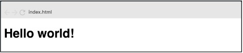

# Ejercicios React - Rolling Code School 
Prácticas con componentes, ciclo de vida del componente, eventos etc.

## Ejercicio N°1: Hello world - Dificultad:  🟢

Crear una aplicación web con un componente que muestre en pantalla el mensaje “Hello World”.

 

### Link de Deploy:
- [Netlify](https://lucasecapdevila-tpn1react76i.netlify.app/)