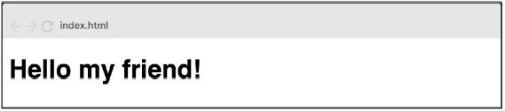

# Ejercicios React - Rolling Code School 
Prácticas con componentes, ciclo de vida del componente, eventos etc.

## Ejercicio N°2: Hello world (parte 2)- Dificultad: 🟢

Modificar el componente anterior y enviar mediante props el valor “My friend” de
manera que el mensaje quede de la siguiente forma:

 

### Link de Deploy:
- [Netlify](https://lucasecapdevila-tpn2react76i.netlify.app/)